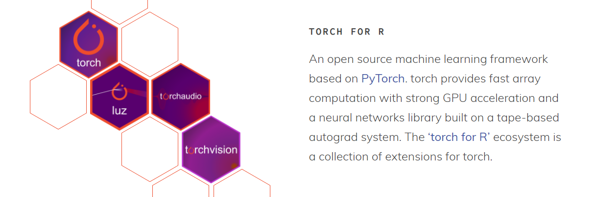
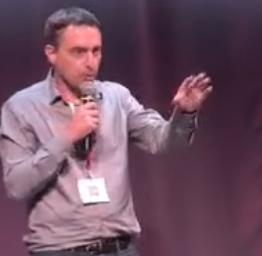

On Thursday, 3 February 2022 we are welcoming Christophe Regouby to RBelgium during an online meetup: [https://www.meetup.com/RBelgium/events/282452150/](https://www.meetup.com/RBelgium/events/282452150/)!

Christophe will present us: The [tabnet](https://cran.r-project.org/package=tabnet) R package, or how to outperform XGBoost and LightGBM on tabular data, relying on [torch](https://torch.mlverse.org).
Google's TabNet is a state of the art modeling architecture for tabular data that enables interpretability and performance ([see paper](https://arxiv.org/abs/1908.07442)).

R users interested in how they can build deep learning tools on top of the recent [torch](https://torch.mlverse.org) R package (which interfaces to the C++ libtorch library) will probably also be interested in this. The tabnet package is one of the packages part of the [mlverse ecosystem](https://torch.mlverse.org/packages/).

If you want to learn about TabNet, torch and self-supervised learning, join us online at [https://www.meetup.com/RBelgium/events/282452150/](https://www.meetup.com/RBelgium/events/282452150/)
The online session is held on 2022-02-03 between 19h and 20h30 CET. All open and free of course.

### About Christophe

Christophe Regouby is a Data-scientist at Airbus' core AI team. He typically works on Document AI, NLP and data-visualization. Open source projects of him can be found at [https://github.com/cregouby](https://github.com/cregouby)

### See you soon!

You can be kept up to date with upcoming RBelgium meetups at [https://www.meetup.com/RBelgium](https://www.meetup.com/RBelgium).
> If you have topics to cover, feel free to contact [one of us](https://www.meetup.com/RBelgium/members/?op=leaders) through Meetup and we will be happy to host it.

