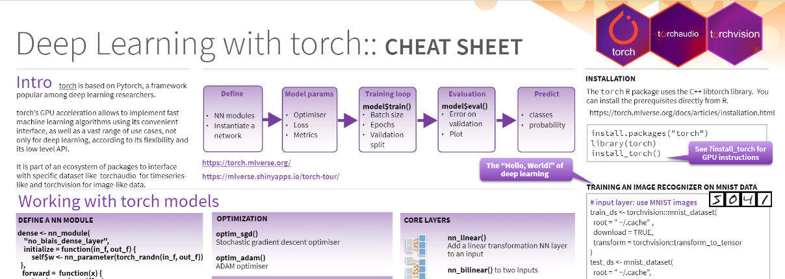

You can see the recorded presentation below of the [RBelgium](https://www.meetup.com/RBelgium) session we held last week (on Thursday 2022-02-03). 
[Christophe Regouby](https://github.com/cregouby) (co-author of the [tabnet](https://cran.r-project.org/package=tabnet) R package) talked about

- the design of the the recent [torch](https://torch.mlverse.org) R package which interfaces with the libtorch C++ library for deep learning
- his torch for R cheat sheet [available here](https://github.com/cregouby/R-toulouse-tabnet/blob/main/Torch_Tabnet_R_en.pdf)

- the high-level setup of [tabnet](https://cran.r-project.org/package=tabnet) and the use of [tabnet](https://cran.r-project.org/package=tabnet) for supervised and unsupervised modelling
- how to run tabnet from R and how to visualise the model results
- recent additions he made to the package at https://github.com/mlverse/tabnet

And answered the numerous questions from the audience.

Enjoy the recordings below, [download the presentation](https://github.com/cregouby/R-toulouse-tabnet/blob/main/Torch_Tabnet_R_en.pdf) and if you have further questions, you can join the tabnet/torch discussion at the discord channel at https://discord.com/invite/s3D5cKhBkx



You can be kept up to date at upcoming meetups at [https://www.meetup.com/RBelgium](https://www.meetup.com/RBelgium).
>> If you have topics to cover, feel free to contact [one of us](https://www.meetup.com/RBelgium/members/?op=leaders) through Meetup and we will be happy to host it.